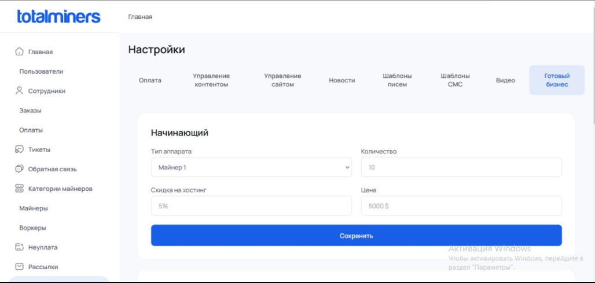
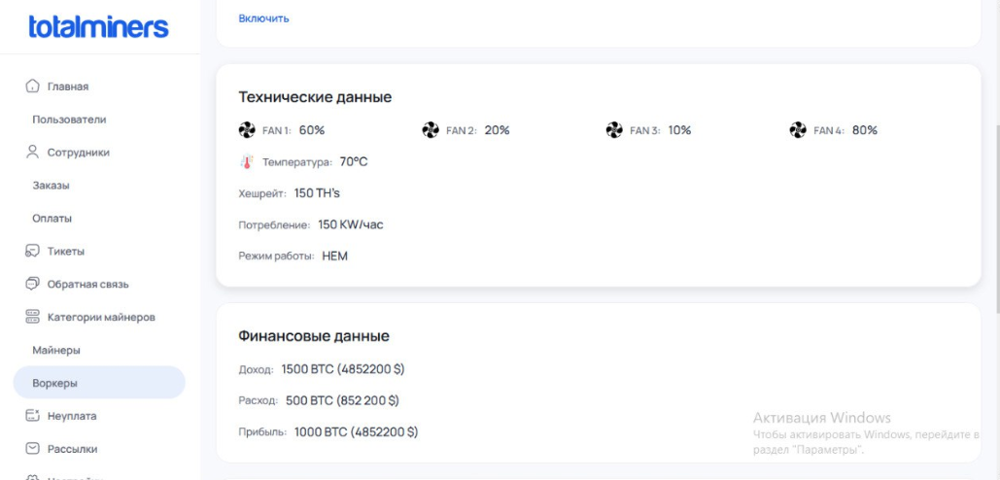
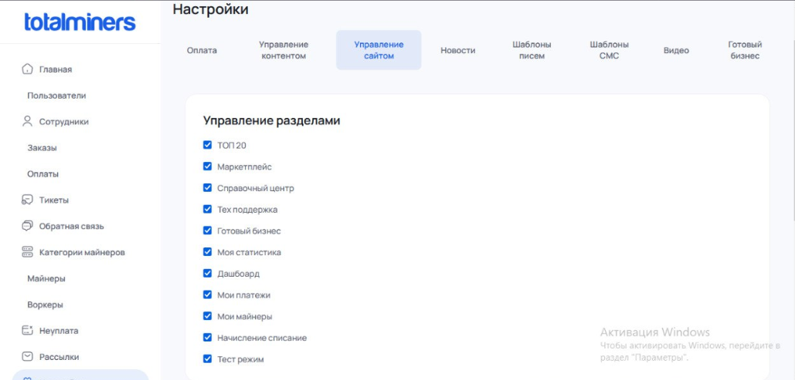

# TotalMiners Admin Panel 📊


<p align="center">
totalminers.io
</p>
<p align="center">
  
  
  
</p>


The frontend part of the control panel for the **totalminers.io** mining hotel. This application is designed specifically for platform administrators to manage users, workers, billing, and integrations.

<p align="center">
  
</p>


---

## 🛠️ Tech Stack
* **Framework:** `Vue.js` (Vue CLI)
* **Web Server:** `Nginx` (used for containerization and serving static production builds)
* **Containerization:** `Docker`

---

<p align="center">
  
</p>

<p align="center">
  
</p>

## 🚀 Local Development Setup

### 1. Install Dependencies
Run the following command to download and install the required node modules:
```bash
npm install
```

### 2. Start the Development Server
Launch the local server with hot-reload enabled:
```bash
npm run serve
```
> The application will be accessible locally, typically at `http://localhost:8080/`.

### 3. Production Build
Compile and minified files for production deployment:
```bash
npm run build
```

### 4. Code Linting & Formatting
Run the linter to inspect the codebase and automatically fix style issues:
```bash
npm run lint
```

---

## 🐳 Production Deployment (Docker & Nginx)

The project is fully containerized. A multi-stage `Dockerfile` is utilized for production deployment. It compiles the static Vue.js assets and serves them via an optimized `Nginx` web server configuration.

### Build and Run the Docker Container:

1. **Build the Docker image:**
   ```bash
   docker build -t admin-mining .
   ```

2. **Run the container (exposed on port 80):**
   ```bash
   docker run -d -p 80:80 --name totalminers-admin admin-mining
   ```

---

## 🗂️ Key Configuration Files

* `nginx.conf` — Routing, proxying, and static file serving configurations for the Vue application.
* `vue.config.js` / `jsconfig.json` — Vue CLI builder adjustments and path aliases configuration.
* `data.json` — Static or mock dataset utilized for the administration dashboard's local operation.
